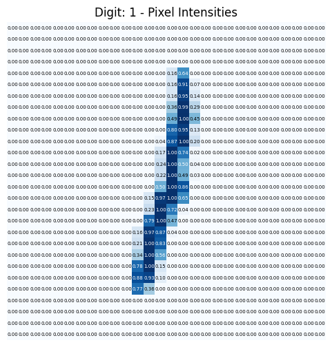
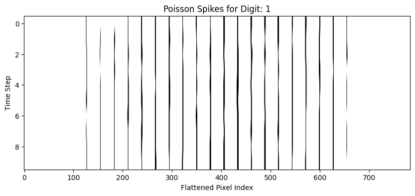
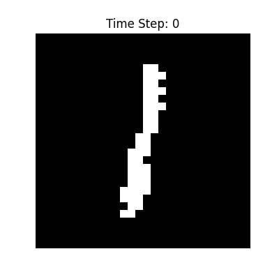
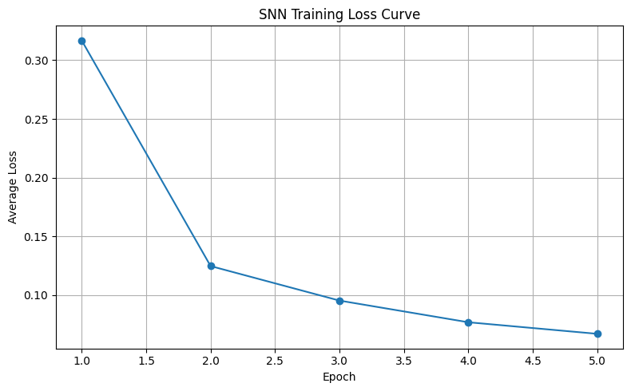
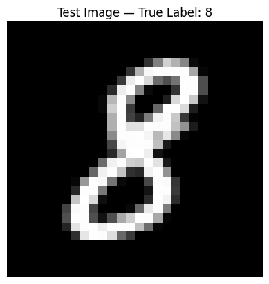
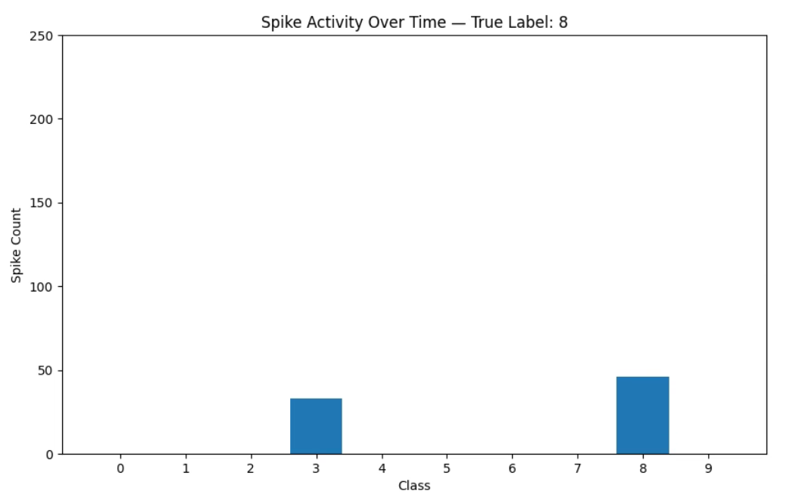

### Task 1: Data Pre-processing (Spike Encoding)
#### 1.Download and pre-process the MNIST dataset.
+ Here I'm using SNNTORCH library developed by SNN researcher [Jason Eshraghian](https://www.jasoneshraghian.com/)
+ At first we'll import the required libraries
+ <span style="color:yellow"> Here the matplotlib.animation is added to visualize the spike trains later...

</span>
```python
import snntorch as snn
import snntorch.functional as SF
import snntorch.surrogate as surrogate
from snntorch import spikegen
import torch.nn as nn
import torch
import torch.nn as nn
import torchvision
import torchvision.transforms as transforms
import matplotlib.pyplot as plt
import matplotlib.animation as animation
```

+ No GPU for me :P
+ And that won't matter mostly as SNN is a third gen computing and requires very low energy and is robust on CPU as well..
+ I'm using the Rate Method instead of temporal method. DOing Poisson rate encoding for 100 steps slows down the training process...
+ I've used random seed 42 (the classic..)+ No GPU for me :P

```python
import numpy as np
np.random.seed(42)
device = torch.device("cuda" if torch.cuda.is_available() else "cpu")
```

>As mentioned earlier.. rate encoding steps are taken to be 10

(more the merrier but training time increases dramatically)
the 60,000 MNIST image datasets would be trained in batches of 128


```python 
num_steps = 10
num_epochs=5 # Time steps for spike simulation
batch_size = 128
learning_rate = 1e-3
num_classes = 10 # constant for this problem.. classes being labels from 0 to 9 (both inclusive)
```

+ Here we are importing MNIST images dataset in .data folder for training (60,000) and testing (10,000)
+ I am using torch dataset and transforms provided by pytorch as it has the compose method which makes all the preprocessing code fit in one line

```python
transform = transforms.Compose([transforms.ToTensor()])

train_data = torchvision.datasets.MNIST(root='./data', train=True, transform=transform, download=True)

test_data = torchvision.datasets.MNIST(root='./data', train=False, transform=transform) 

train_loader = torch.utils.data.DataLoader(train_data, batch_size=batch_size, shuffle=True)
test_loader = torch.utils.data.DataLoader(test_data, batch_size=batch_size, shuffle=False)
```

#### 2.Implement Poisson rate coding to convert pixel intensities into spike trains. Higher pixel intensities should correspond to higher firing rates.

>This is a crazy thing and crux of our model so We'll read and explain this carefully:
+ First of all we input images and num_steps to the function to give us a tensor 
```python
torch.rand((num_steps, batch_size, *image_shape), device=images.device)
```
+ <span style="color:orange"><em>

This type of tensor size would make sense after visualizing it</em></span>
+ All it does is,

	+  it input an image batch of batch size being primitive size of image tensor input.

	+ Hence we use `batch_size = images.shape[0]`

	+ then for an image of size 28x28, it creates a tensor of size num_stepsx28x28 for each pixel in any image.. its intensity determines the rate at which a spike is fired (Again, if this is harder to grab.. see the visualization part)

```python
def poisson_spike_encoding(images, num_steps=100):
batch_size = images.shape[0]

image_shape = images.shape[1:]

rand_vals = torch.rand((num_steps, batch_size, *image_shape), device=images.device)

spike_trains = rand_vals < images.unsqueeze(0)

return spike_trains.float()
```

#### 3.Visualize sample input spike patterns for various digits to verify that encoding is working correctly.

**I have loaded an MNIST image of class 1 to give some insights**
+ Also I've plotted the cell grid in MNIST to see the image as a grid of pixel intenities in blue colour because the black one would've overlapped

```python 
choice=1
dataiter = iter(train_loader)
images, labels = next(dataiter)
images, labels = images.to(device), labels.to(device)
zero_index = (labels == choice).nonzero(as_tuple=True)[0][0]
image_zero = images[zero_index].unsqueeze(0)

fig, ax = plt.subplots(figsize=(6, 6))
image_data = image_zero[0, 0].cpu().numpy()
table = ax.imshow(image_data, cmap='Blues', vmin=0, vmax=1)
# Adding to show all the pixel values as text on a grid like strudcture
for i in range(28):
for j in range(28):

val = image_data[i, j]
ax.text(j, i, f"{val:.2f}", ha="center", va="center",
color="white" if val > 0.5 else "black", fontsize=5)

  
ax.set_title("Digit: 1 - Pixel Intensities")
ax.axis('off')
plt.show()
```

```python
# Generate possion spikes for digit one
spike_trains = poisson_spike_encoding(image_zero, num_steps=num_steps) # shape: (num_steps, 1, 1, 28, 28) as explained above
# Plot spike analysis for digit 1..
fig, ax = plt.subplots(figsize=(10, 4))

raster = spike_trains[:, 0, 0].reshape(num_steps, -1).cpu().numpy()
ax.imshow(raster, cmap='Greys', aspect='auto')
ax.set_title("Poisson Spikes for Digit: " + str(choice))
ax.set_xlabel("Flattened Pixel Index")
ax.set_ylabel("Time Step")
plt.show()

```
+ Loads digit 1 image from MNIST data set and performs poisson encoding on it..


<p align="center">
  
</p>


<p align="center">
  
</p>
 + We use digit 1 because most of bright pixels are located at middle column hence if we arrange the 28x28 array as a 1-D 784 array.. we get a bright pixel periodically with period 28..
 
+ Now when we plot the poisson spike train... we see the claim that for 10 time steps... the pixels after 150 fire almost always with period of 28 (as every 28th pixel is bright in image of 1)
<p align="center">
  
</p>

+ This is a simulation of how the network sees the image as spike table.. the boundary pixels flicker because their intensity is around 0.7-0.8 but the middle pixels never flicker as they are extremely bright and are fired everytime.

```python
from IPython.display import Image, display
spikes = spike_trains[:, 0, 0].cpu().numpy() # (num_steps, 28, 28)
fig, ax = plt.subplots(figsize=(4, 4))
im = ax.imshow(spikes[0], cmap='gray', vmin=0, vmax=1)
ax.axis('off')

def update(t):
im.set_array(spikes[t])
ax.set_title(f'Time Step: {t}')
return [im]

ani = animation.FuncAnimation(fig, update, frames=num_steps, interval=50, blit=True)
# Save GIF locally and also to display it in notebook
gif_path = "mnist_spike_flash.gif"
ani.save(gif_path, writer='pillow', fps=5)
plt.close(fig)

# display inline in notebook!
display(Image(filename=gif_path))
```

### Task 2: SNN Model Implementation

#### 1.Design a 3-layer SNN architecture:
We define a 3 layer SNN architecture having:
+ Input layer to recieve the spike trains.
+ Hidden Layer
+ Output layer(Corresponding to digit class 0-9)

#### 2.Implement the Leaky Integrate-and-Fire (LIF) neuron model
+ **Membrane potential dynamics with leakage**: snn.leaky models Leaky-Integrate-fire neurons where the potential across a membrane decays(leaks) if there is no input.
+ **Learning method**: Supervised learning with surrogate gradients is used
+ Here we define the SurrogateSpike class (as the real spike functions as discrete and not differentiable)
+ We used [@staticmethod](https://www.programiz.com/python-programming/methods/built-in/staticmethod) to call the forward and backward method without crating an object explicitly
+ We apply chain rule ourselves in the return of backward method to mimic Heaviside function inputs.

``` python
class SurrogateSpike(torch.autograd.Function):

@staticmethod
def forward(ctx, input):
ctx.save_for_backward(input)
return (input >= 1.0).float()

@staticmethod
def backward(ctx, grad_output):
input, = ctx.saved_tensors

# Example: fast sigmoid surrogate gradient
grad_input = grad_output.clone()
sigmoid_grad = 1 / (1 + torch.exp(-10 * (input - 1))) # derivative of fast sigmoid approx
return grad_input * sigmoid_grad * (1 - sigmoid_grad)
```

+ Here we define the Leaky neuron model (inspired by our brain) to be operated on the spike trains.
```python

membrane_potential = self.beta * membrane_potential + input_current

```
....is the leaky integration step
```python

spike = SurrogateSpike.apply(membrane_potential)

```
... applies the spike surrogate ftn.
```python
membrane_potential = membrane_potential * (1.0 - spike)
```
...this is the reset mechanism

```python
class LIFNeuron(nn.Module):

def __init__(self, beta=0.95, threshold=1.0):
super().__init__()
self.beta = beta
self.threshold = threshold

def forward(self, input_current, membrane_potential):
membrane_potential = self.beta * membrane_potential + input_current

# Use surrogate spike with custom gradient
spike = SurrogateSpike.apply(membrane_potential)

# Reset membrane potential where spike occurred
membrane_potential = membrane_potential * (1.0 - spike)
return spike, membrane_potential

def init_leaky(self, shape, device):
return torch.zeros(shape, device=device)
```

+ This the the main Spiking Network 3 layers
	+ fc1: 784 → 512 (Input layer)
	+ fc2: 512 → 256 (Hidden layer)
	+ fc3: 256 → 10 (Output layer)

```python
class SNNModel(nn.Module):

def __init__(self):
super().__init__()
self.flatten = nn.Flatten()
  
self.fc1 = nn.Linear(28 * 28, 512)
self.lif1 = LIFNeuron(beta=0.95)

self.fc2 = nn.Linear(512, 256)
self.lif2 = LIFNeuron(beta=0.95)

self.fc3 = nn.Linear(256, 10)
self.lif3 = LIFNeuron(beta=0.95)

def forward(self, x, num_steps=100):
batch_size = x.shape[1]

mem1 = self.lif1.init_leaky((batch_size, 512), x.device)
mem2 = self.lif2.init_leaky((batch_size, 256), x.device)
mem3 = self.lif3.init_leaky((batch_size, 10), x.device)

spk3_rec = []
for step in range(num_steps):

		x_t = x[step]
		x_t = self.flatten(x_t)
		cur1 = self.fc1(x_t)
		spk1, mem1 = self.lif1(cur1, mem1)
		
		cur2 = self.fc2(spk1)
		spk2, mem2 = self.lif2(cur2, mem2)
		
		cur3 = self.fc3(spk2)
		spk3, mem3 = self.lif3(cur3, mem3)
		spk3_rec.append(spk3)

return torch.stack(spk3_rec)
```

### Task 3: Training and Evaluation
> I've came to know about tqdm to add progress bar into loops :P so why not use it!!

+ I've trained the SNN using Surrogate gradient descent
+ As a loss ftn I've used cross Entropy loss as it is good for classification problems. It implements the idea for probnability. Learn more on it [here!](https://docs.pytorch.org/docs/stable/generated/torch.nn.CrossEntropyLoss.html)

```python
from tqdm import tqdm
optimizer = torch.optim.Adam(net.parameters(), lr=1e-3)
loss_fn = nn.CrossEntropyLoss()
loss_history = []
for epoch in range(num_epochs):

net.train()
running_loss = 0.0

for i, (images, labels) in enumerate(tqdm(train_loader, desc=f"Epoch {epoch+1}")):

images = images.to(device)
labels = labels.to(device)

spk_in = poisson_spike_encoding(images, num_steps=num_steps)
spk_out = net(spk_in, num_steps=num_steps)

spk_out_count = spk_out.sum(dim=0)

  

#Loss computation (Cross Entropy expects raw scoores with integer labels and is good for classification)
loss_val = loss_fn(spk_out_count, labels)

#Backprop
optimizer.zero_grad()
loss_val.backward()
optimizer.step()
running_loss += loss_val.item()

if i % 100 == 0:
print(f" Batch {i}, Loss: {loss_val.item():.4f}")  
avg_loss = running_loss / len(train_loader)
loss_history.append(avg_loss)
print(f"Epoch {epoch+1} Completed — Avg Loss: {avg_loss:.4f}")

# Ploting the training loss --- Assumed to follow a decaying convex up curve for good model (source D2L.ai)
plt.figure(figsize=(8, 5))
plt.plot(range(1, num_epochs + 1), loss_history, marker='o', linestyle='-')
plt.title("SNN Training Loss Curve")
plt.xlabel("Epoch")
plt.ylabel("Average Loss")
plt.grid(True)
plt.tight_layout()
plt.show()
```

<p align="center">
  
</p>

+ Training for 5 epochs only gave good progress.. similar to ANN (97.5% accuray) even without neuromorphic hardware.

```python
def evaluate(net, test_loader, num_steps=100):

net.eval()
correct = 0
total = 0  

with torch.no_grad():

for images, labels in test_loader:

images = images.to(device)
labels = labels.to(device)

spk_in = poisson_spike_encoding(images, num_steps)
spk_out = net(spk_in, num_steps)
spk_out_count = spk_out.sum(dim=0)
predicted = spk_out_count.argmax(1)

correct += (predicted == labels).sum().item()
total += labels.size(0)

acc = 100 * correct / total
print(f"Test Accuracy: {acc:.2f}%")
evaluate(net, test_loader)
```

### Takeaways:
+ Despite SNN being theoretically better than ANN, we say how SNN performs almost similar to ANN in terms of speed and accuracy and power draw.
+ However this is a good thing that even without neuormorphic chips (native for SNN), we get such good performance
+ This practice helps us understand how our real brain works on such low power (our brain is neuromorphically modified)

```python
import matplotlib.pyplot as plt
import matplotlib.animation as animation
from IPython.display import Video, display
import random

images, labels = next(iter(test_loader))
idx = random.randint(0, images.shape[0] - 1)
test_img = images[idx].unsqueeze(0).to(device)
true_label = labels[idx].item()

# Display the selected one test image
plt.imshow(test_img.squeeze().cpu(), cmap='gray')
plt.title(f"Test Image — True Label: {true_label}")
plt.axis('off')
plt.show()  

# Poisson encode the test image to pass it in the SNN model
test_spikes = poisson_spike_encoding(test_img, num_steps=100) # [nuim_steps, 1, 1, 28, 28]

# Running through SNN
spk_rec = net(test_spikes.to(device), num_steps=100).squeeze(1).detach().cpu()

# Spike count animation(found this snippet in a kaggle notebook)
fig, ax = plt.subplots(figsize=(10, 6))
bars = ax.bar(range(10), [0]*10, tick_label=list(range(10)))
ax.set_ylim(0, 250)
ax.set_title(f"Spike Activity Over Time — True Label: {true_label}")

ax.set_ylabel("Spike Count")
ax.set_xlabel("Class")

def update(frame):

for i, b in enumerate(bars):
b.set_height(spk_rec[:frame+1, i].sum().item())
return bars
ani = animation.FuncAnimation(fig, update, frames=100, blit=False, interval=100)

# Save & Display Inline
video_path = "spike_activity.mp4"
ani.save(video_path, writer='ffmpeg', fps=5)
plt.close()
display(Video(video_path, embed=True))
```


<p align="center">
  
</p>



+ We see that we recieve output spikes for other labels (here 3) as well (apart from true label=8 ) as we see in the image that digit 8 shown is quite similar to digit 3 as well.

+ This tool for visualization was inspired by [this notebook!](https://www.kaggle.com/code/khoahongg/classify-n-mnist-with-spiking-neural-network/notebook)
+ Try running this block without training the model (i.e at 11% accuracy) as well :P

### Resources used:

  1. I came to know of SNN through a video of Jason Eshraghian (Lead developer of SNN torch). I've self curated a [playlist](https://www.youtube.com/playlist?list=PLtO_DmDV5KcVWKdvM8ZEx_eti4dkX0lrt) of his tutorial to use SNNtorch.
	+ The extremely well curated [documentation of SNNtorch](https://snntorch.readthedocs.io/en/latest/tutorials/index.html)

  2. To understand the difference b/w ANN and SNN, the 3 types of harwares chronologically used in ML (neuromorphic being the latest) I highly recommed [this paper](https://oshears.github.io/adv-ml-2020-snn-project/report/Advanced_Machine_Learning_Project_Report.pdf) by


